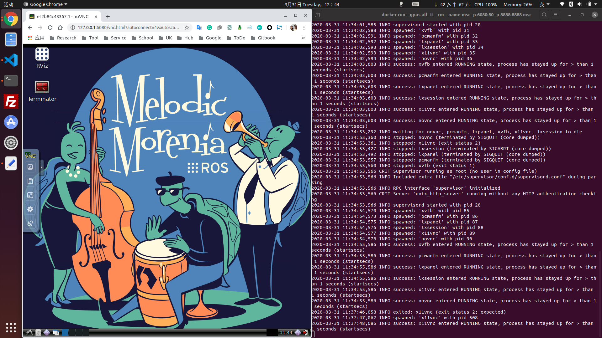

# Robot localisation docker image


A Development environment based on ubuntu 18.04 with the LXDE desktop environment. It contains a variety of deep learning development environments based on pyhton3 ( tensorflow, gpflow, tf). It has a friendly graphical interface and can also run python commands through the terminal.

Docker Link: [ROS GPU](https://hub.docker.com/r/silvesterhsu/ros-gpu)

Github Link: [ROS GPU](https://github.com/SilvesterHsu/docker-ros-gpu)

## What's in it?
* Python 3.6
* CUDA 9.0
* Cudnn 7.4.1.5
* Tensorflow 1.12.0 (GPU supported)
* GPflow 1.3
* ROS Melodic Morenia (Build for pyhton3)

> The **versions** above can be edited in the `Dockerfile`, then the image needs to be built.

## Which systems can use it？
* Windows (GPU not supported)
* Mac OS
* Linux

**Make GPU available to docker:**
According to [Nvidia guidance](https://github.com/NVIDIA/nvidia-docker), for first-time users of Docker 19.03 and GPUs, continue with the instructions for getting started below.
```bash
# Add the package repositories
distribution=$(. /etc/os-release;echo $ID$VERSION_ID)
curl -s -L https://nvidia.github.io/nvidia-docker/gpgkey | sudo apt-key add -
curl -s -L https://nvidia.github.io/nvidia-docker/$distribution/nvidia-docker.list | sudo tee /etc/apt/sources.list.d/nvidia-docker.list

sudo apt-get update && sudo apt-get install -y nvidia-container-toolkit
sudo systemctl restart docker
```

## How does it look?


> VNC is turned on automatically by default, and Jupyter notebook is not started by default.

## How to use?

### Step 1: Use docker for quick start
```bash
docker run -it --name ros --restart=always --gpus all -p $PORT:6606 -p $PORT:8888 -p $PORT:80 -v "$PWD":/notebooks silvesterhsu/ros-gpu:"$TAG"
```
`$PORT`: Port mapping. It is the port that needs to link the local to the image. In docker, jupyter will open port 8888 as a web access. If the local port 8888 is not occupied, it is recommended to use 8888. Similarly, 6006 is the port of tensorboard and 80 is the port of browser.

`$PWD`: File mapping. Project work path

`$TAG`: For the time being, only latest and slim, if not filled in, the latest version is downloaded by default. The ARM version may be available in the future.

**Example:**
```bash
docker run -it --name ros --restart=always --gpus all -p 6006:6606 -p 8888:8888 -p 6080:80 -v ~/new_project:/notebooks silvesterhsu/ros-gpu
```
### Step 2: Access through browser and vnc viewer

**Easy access via browser** (recommended)

Browse http://127.0.0.1:6080/

**Access via VNC**
Forward VNC service port 5900 to host by adding `-p 5900:5900` in the docker run.

VNC password is also supported. Set by environment variables `-e VNC_PASSWORD=passwd`.
### Step 3: Start a Jupyter notebook (optional)
You can connect via `docker exec -it ros /bin/bash`, or use the *Terminator* in the graphical interface to start jupyter.
```bash
jupyter notebook --ip=0.0.0.0 --allow-root
```
Browse http://127.0.0.1:8888/

**Note:** if you use docker to connect, you need to load the **ROS environment** first by
```bash
source /opt/ros/melodic/setup.bash
source /root/catkin_ws/devel/setup.bash
```
### Step 4: Terminal (optional)
Connect via `docker exec -it ros /bin/bash`.
